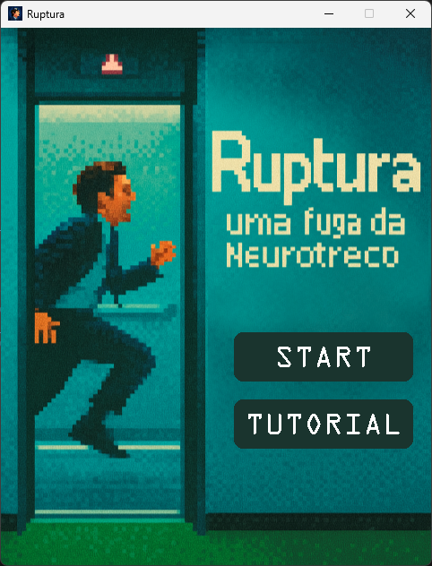
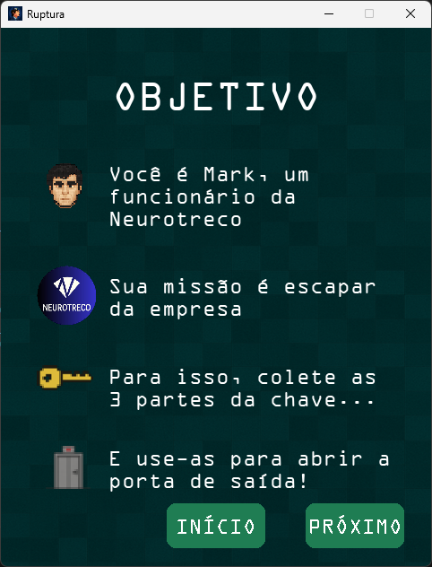
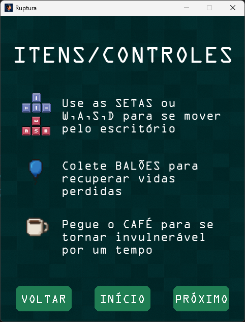
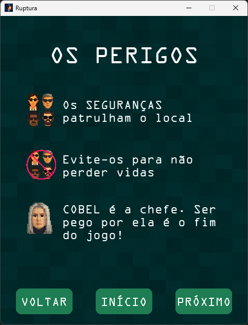
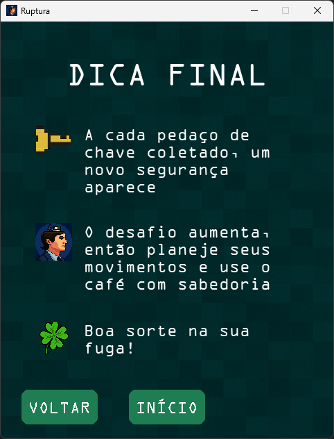
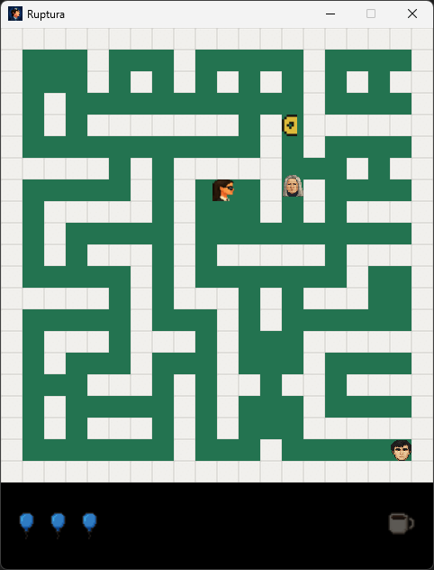
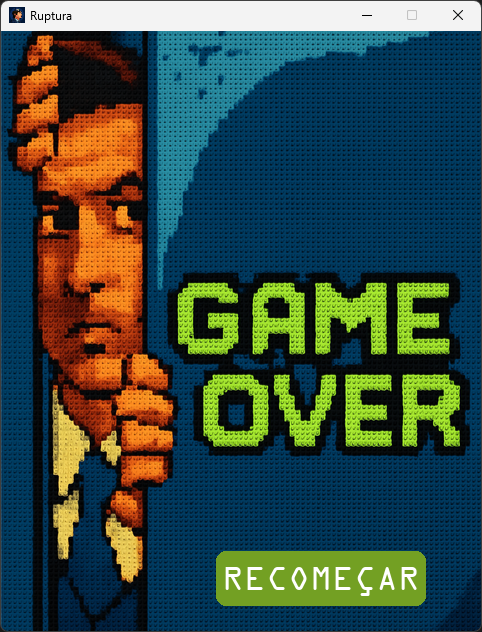
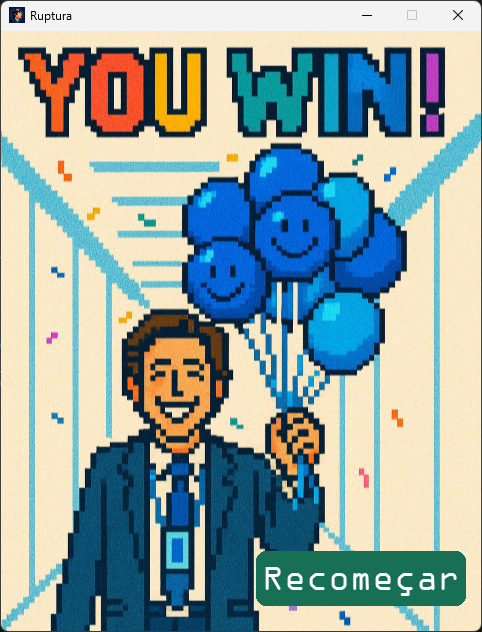

# Projeto final de Introdução à Programação: _Ruptura Game_ ▶️

Este projeto consiste em um jogo 2D desenvolvido como parte da disciplina de Introdução à Programação. Utilizando a biblioteca _Pygame_, criamos esse jogo interativo, que coloca em prática os conhecimentos adquiridos ao longo do semestre, desde estruturas de controle e manipulação de eventos até o uso de recursos gráficos e sonoros, unindo programação e criatividade.

A temática principal é inspirada na série _Ruptura (Severance)_, cuja ambientação enigmática e estética minimalista influenciaram fortemente a construção dos cenários, da paleta de cores e da atmosfera geral do jogo. Buscamos reproduzir a sensação de mistério e tensão característica da obra, adaptando-a para um formato interativo, no qual o jogador mergulha em um mundo dividido entre o trabalho e a vida pessoal, enfrentando desafios que testam tanto a lógica quanto a atenção aos detalhes. Ao longo do desenvolvimento, exploramos diferentes ideias de programação, narrativa e design, sempre buscando manter a identidade visual e o clima narrativo que definem o universo de _Ruptura_.

## Membros da Equipe 5 👥 
<table>
  <tr>
    <td align="center">
      <a href="https://github.com/analauraboliveira">
         
        Ana Laura Barboza (<code>albos</code>)
      </a>
    </td>
    <td align="center">
      <a href="https://github.com/Izadora1">
         
        Izadora Andrade (<code>itga</code>) 
      </a>
    </td>
    <td align="center">
      <a href="https://github.com/laissaraiva">
         
        Laís Saraiva  (<code>lspc</code>)
      </a>
    </td>
    <td align="center">
      <a href="https://github.com/lauravfonseca">
         
        Laura Fonseca (<code>lvnf</code>)
      </a>
    </td>
    <td align="center">
      <a href="https://github.com/lestrb">
         
        Letícia Staudinger (<code>lsr</code>) 
      </a>
    </td>
    <td align="center">
      <a href="https://github.com/safiracode">
         
        Safira Moraes (<code>smg</code>) 
      </a>
    </td>
  </tr>
</table>

## Divisão de tarefas do projeto 👨‍💻

| Time                                                  | Tarefas                                                                                |
| ----------------------------------------------------- | -------------------------------------------------------------------------------------- |
| [Ana Laura Barboza]                                   | Desenvolvimento do código e solução de problemas, design dos personagens, sonoplastia do jogo, organização do código, documentação nas planilhas e organização do GitHub |
| [Izadora Andrade]                                     | Desenvolvimento do código e solução de problemas, Implementação do Mark, Implementação da tela de Game Over, Auxílio no README.md   |
| [Laís Saraiva]                                        | Desenvolvimento do código e solução de problemas, Implementação da tela Start, Implementação das telas de Tutorial, Implementação da tela de Game Over da Cobel, Geração de algumas sprites |
| [Laura Fonseca]                                       | Desenvolvimento do código e solução de problemas, Implementação de sons do jogo, Apresentação final dos slides, Design da tela "You Win", Implementação da tela Venceu, Auxílio no README.md|
| [Letícia Staudinger]                                  | Desenvolvimento do código e solução de problemas, Geração das sprites, ⁠Implementação: sprites, mudança de sprite para cada direção, porta de saída do labirinto, imagens telas de tutorial, fonte textos, ⁠Contribuições: ajustes finais tela tutorial (fundo, botões, textos, tamanhos, margens), ajustes botões telas de game over e de win, ajuste movimentação da Cobel, ⁠Organização dos arquivos de imagem|
| [Safira Moraes]                                       | Desenvolvimento do código e solução de problemas, Organização e criação da base do codigo, Implementação do mapa aleatório, Implementação dos coletáveis: balão, chave e café, Implementação dos seguranças e algoritmo de busca com dois modos: perseguir e dispersar, Melhoria na movimentação do mark, Melhoria no algoritmo de busca da Cobel |

## Arquitetura do projeto e organizacão do código 🏛
Organizamos o _Ruptura Game_ através de arquivos e pastas de acordo com suas funções para facilitar a manutenção e permitir que as integrantes do grupo trabalhasse em partes diferentes do código sem conflitos.  

A estrutura do repositório está organizada assim:  
- `main.py` : ponto de entrada do jogo, onde o Pygame é inicializado e o loop principal é executado.  
- `constants.py` : centraliza variáveis e configurações fixas, como cores, dimensões da tela, FPS e outros parâmetros globais.  
- `mapa.py` : gerencia a estrutura do mapa, posicionamento de elementos e obstáculos.  
- `tela_start.py` : tela inicial do jogo, com título e opções de navegação.  
- `tela_tutorial.py` : apresenta as instruções básicas para orientar o jogador.  
- `game_over.py` : lógica e exibição da tela de derrota padrão.  
- `game_over_cobel.py` : tela de derrota específica para quando Mark é vencido pela personagem Cobel.  
- `venceu.py` : lógica e exibição da tela de vitória.  
- `classes` : contém as classes principais, como personagens, inimigos e objetos coletáveis.  
- `audios` : reúne todos os arquivos sonoros usados no jogo, incluindo efeitos e trilhas.  
- `imagens` : ideias de imagens gerais, como ícones dos coletáveis e os movimentos dos personagens.
- `imagens_jogo` : telas de início, derrota, vitória, tutorial e a tela geral do jogo.
- `ideias de imagens` : material de referência para a criação da estética do jogo.  
- `__pycache__` : arquivos compilados automaticamente pelo Python.  

## Capturas de tela 🖼️

Abaixo estão algumas imagens do jogo:

### Tela Inicial:

  

### Telas Tutorial:

  
  
  
  

### Tela Jogo:

  

### Tela Game Over:

  

### Tela You Win:

  

## Ferramentas, frameworks e bibliotecas utilizados 🛠️ 
Para o desenvolvimento do _Ruptura Game_, utilizamos um conjunto de ferramentas e tecnologias, que tornaram possível criar um projeto funcional, visualmente interessante e tecnicamente funcional. Esses recursos foram:

- **Python** — Linguagem principal do projeto, utilizada para a implementação da lógica, organização das classes e integração de todas as partes do sistema.  
- **Pygame** — Biblioteca que serviu como base para o desenvolvimento gráfico, detecção de eventos, manipulação de sons e controle de animações.  
- **Visual Studio Code** — Editor de código adotado pelo grupo, com suporte a extensões úteis e integração com GitHub.  
- **GitHub** — Usado para o controle de versão, acompanhamento das alterações e colaboração remota de forma organizada.  
- **Canva e Photoshop** — Utilizados para a criação e edição de elementos visuais, preservando a identidade visual.  
- **Discord / WhatsApp** — Aplicativos de comunicação, utilizados para o alinhamento de equipe, com mensagens e reuniões por chamada de vídeo.  
- **YouTube, OpenGameArt e FreeSound** — Bibliotecas de efeitos sonoros e trilhas, para formar a sonoplastia do jogo. 

## Conceitos da disciplina aplicados 💡
Durante o desenvolvimento do _Ruptura Game_, colocamos em prática diversos conceitos vistos ao longo da disciplina, aplicando-os diretamente na lógica e na estrutura do jogo.  

Os _comandos condicionais_ (`if`, `elif`, `else`) foram fundamentais para controlar o fluxo de execução, determinando ações diferentes a depender de eventos como colisões, transições de fases ou escolha de opções no menu. Já os _laços de repetição_ (`for` e `while`) foram essenciais para percorrer coleções de dados, atualizar elementos em tela e manter o _game loop_ rodando de forma contínua até que uma condição de término fosse atingida.  

As _listas_ foram amplamente utilizadas para armazenar e gerenciar elementos do jogo, como conjuntos de sprites, obstáculos e sequências de frames de animação. Em alguns casos, usamos _tuplas_ para representar dados que não precisariam ser modificados, ou seja, que se mantêm constantes ao longo da execução do jogo. O uso de _matrizes_ também foi útil para representar mapas e fases do jogo, em que cada posição correspondia a um elemento do cenário. Isso possibilitou um controle mais intuitivo sobre a disposição dos objetos e facilitou a lógica de colisão e movimentação.  

As _funções_ desempenharam um papel importante na organização do código, separando responsabilidades em blocos lógicos, como: inicializar o jogo, processar entradas do usuário, atualizar o estado dos personagens e renderizar os elementos na tela.

Por fim, também aplicamos _Programação Orientada a Objetos (POO)_ para estruturar o jogo de forma modular e reutilizável. Criamos classes para representar entidades como o jogador, inimigos e elementos de cenário, encapsulando seus atributos e comportamentos e permitindo instanciar múltiplos objetos de forma independente.  

## Desafios, erros e lições aprendidas 💥
> **Qual foi o maior erro cometido durante o projeto? Como vocês lidaram com ele?** 

O maior erro cometido no desenvolvimento do _Ruptura Game_ foi priorizar, nas etapas iniciais, partes do trabalho que poderiam ter sido deixadas para depois, como decisões de design e de sonoplastia, em vez de focar no código base que sustentaria toda a lógica do jogo. Essa escolha acabou atrasando a implementação de funcionalidades essenciais. Para lidar com isso, reorganizamos as prioridades, redistribuindo tarefas para que o núcleo do jogo fosse finalizado antes dos elementos complementares.  

> **Qual foi o maior desafio enfrentado durante o projeto? Como vocês lidaram com ele?** 

O maior desafio foi implementar os seguranças, a lógica da Cobel e os coletáveis de forma que o jogo se mantivesse equilibrado (nem muito fácil, nem excessivamente difícil) e, ao mesmo tempo, garantir que todos esses elementos funcionassem de maneira integrada, simultaneamente. Para superar essa dificuldade, realizamos pesquisas, analisamos referências de jogos semelhantes e realizamos diversos testes para ajustar velocidades, padrões de movimento e posicionamento, até alcançar um resultado coerente com a proposta do jogo.  

> **Quais as lições aprendidas durante o projeto?**  

Uma das maiores lições foi a importância do planejamento prévio para a execução eficiente de qualquer trabalho. Aprendemos também a lidar com uma biblioteca completamente nova, o _Pygame_; a utilizar de forma eficaz uma plataforma de repositório (nesse caso, o GitHub) para gerenciar arquivos em constante mudança; e a trabalhar com Programação Orientada a Objetos, que, até então,não havia sido muito explorada por nós. Além disso, reforçamos a importância de delegar funções de forma equilibrada, organizar o código de forma legível, colaborar ativamente no trabalho em equipe e manter uma comunicação constante, tanto entre os integrantes do grupo quanto com as monitoras e os professores.  

